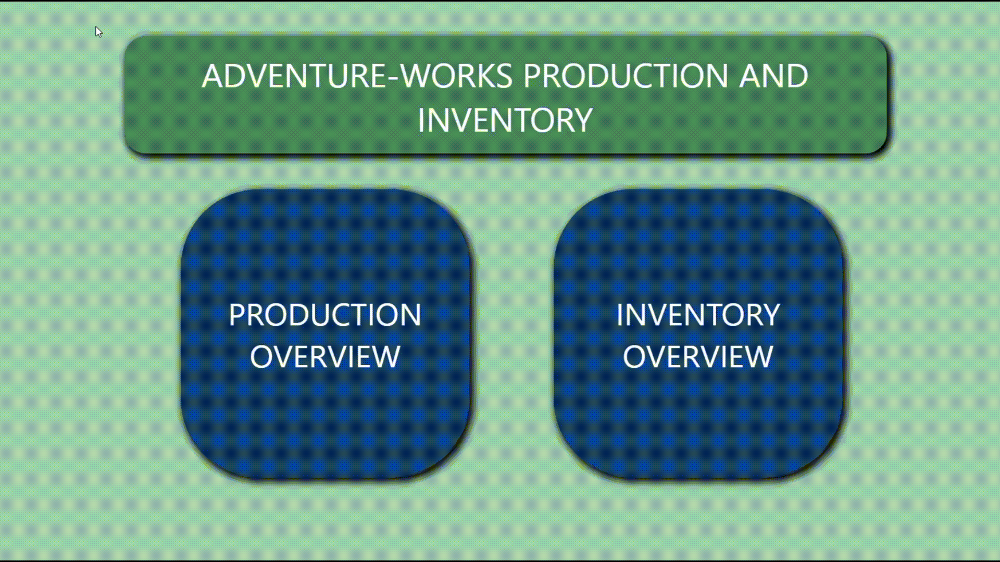
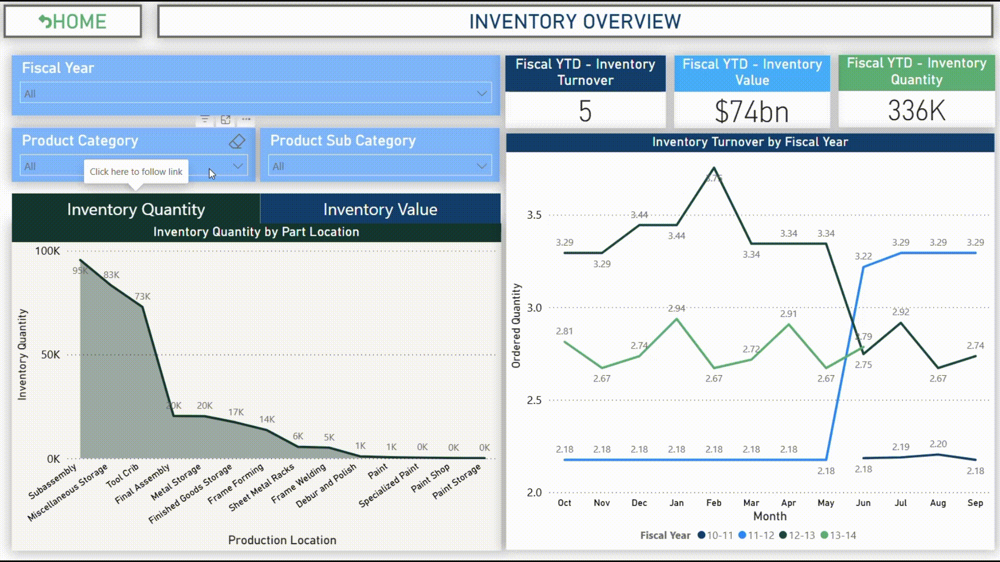

# AdventureWorks-Production-and-Inventory-Analysis
 
## Overview

This analysis goes through the Production and Inventory Analysis of the Microsoft AdventureWorks Database. Adventure Works is a fictional bicycle manufacturing company, this database contains standard transactions data from an Enterprise Resource Planning System. It contains data from the following scenarios of the company: Human Resources, Product Management, Manufacturing, Purchasing, Inventory, Sales, and Admin. 

This analysis focuses on the Manufacturing and Inventory part of the data. Microsoft Power BI has been used to create an interactive dashboard while pulling data from SQL Server.

## Data Source

[Data Source](https://docs.microsoft.com/en-us/sql/samples/adventureworks-install-configure?view=sql-server-ver15&tabs=ssms)

## Data Model

## Built With

•[Power BI](https://powerbi.microsoft.com/en-us/)
•[SQL Server](https://www.microsoft.com/en-us/sql-server/sql-server-downloads)

## Detailed Analysis

### Tables used in the model: -

- Production Location - Has Production assembly data, 1.e. Parts used to manufacture each product are defined here with an assembly location category
- Production Product - Data related to products, their physical details, price, etc.
- Production ProductCategory - Products and their defined categories
- Production ProductSubcategory - Products and their subcategories
- Production ProductInventory - Inventory data of the produced products
- Production ScrapReason - Waste Data related to manufacturing
- Production WorkOrder - Production transactions and related data
- Production WorkOrderRouting - Production work order scheduling data and details
- Sales SalesOrderDetail - Transactional Sales Data

## Dashboard

The main features of the dashboard are shown below in a videos.

<!-- ## Screenshots

 -->

